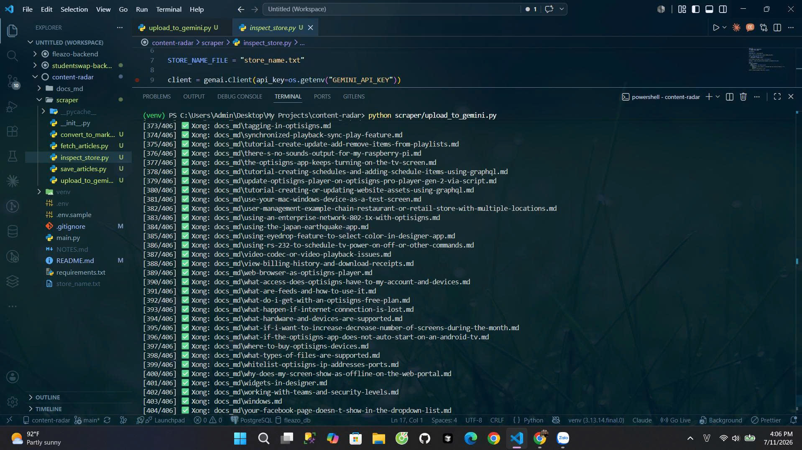
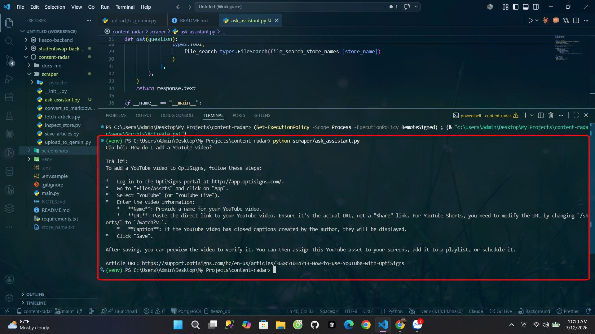

# Content Radar

Small pipeline that scrapes a support knowledge base, converts articles to
clean Markdown, and syncs them into Gemini File Search as the knowledge
base for a support bot (basically an OptiBot clone). Includes a daily job
to keep it in sync with new/updated articles.

## Setup

1. Clone this repo
2. Create a virtual environment: `python -m venv venv`
3. Activate it: `.\venv\Scripts\activate` (Windows) or `source venv/bin/activate` (Mac/Linux)
4. Install dependencies: `pip install -r requirements.txt`
5. Copy `.env.sample` to `.env` and fill in your `GEMINI_API_KEY` (free key at https://aistudio.google.com/api-keys)

## How to run locally

### One-off setup: scrape + upload individually

```
python scraper/save_articles.py
python scraper/upload_to_gemini.py
```

These two scripts do the scrape and the upload as separate steps (useful
for testing each part independently). `save_articles.py` calls the support
site's Zendesk API (paginated), converts each article's HTML `body` to
Markdown with `markdownify`, and saves one `.md` file per article into
`docs_md/`. `upload_to_gemini.py` uploads every `.md` file into a Gemini
File Search Store via the API, skipping files already present.

### Daily sync (the actual pipeline used in production)

```
python main.py
```

This is the real entry point — it wraps scraping and uploading together,
plus delta detection (see below) so re-runs only touch what's actually
changed.

## Data source

- 406 articles pulled from the support site via the Zendesk Help Center API.
- 405/406 uploaded successfully (~99.75%). One article
  (`how-to-use-the-qr-scan-to-interact-touchless-qr-app.md`) consistently
  failed with `400 Bad Request: Upload has already been terminated`, even
  after several retries — looks like something specific to that request
  rather than a one-off network blip. Since the task only requires ≥30
  articles, I didn't dig further into it.

Upload log (final run):

```
Found 406 local files.
Need to upload: 406 files. (Skipping 0 already present)
...
=== RESULT ===
Success: 405
Failed: 1
Skipped (already present): 0
```



## Daily sync / delta detection

`main.py` is the entry point for the daily job. Instead of re-scraping and
re-uploading everything every time, it keeps a small `state.json` file that
remembers each article's `id` and `updated_at` from the last run. On each
run:

- If an article's `updated_at` matches what's in `state.json` → skipped
  entirely (no file rewrite, no upload).
- If it's a new article, or `updated_at` changed → the old version (if any)
  is deleted from the File Search Store, and the new version is uploaded.

First run (empty `state.json`, everything is new):

```
Need to process: 406 articles. Unchanged (skip): 0 articles.
...
=== SYNC RESULT ===
Added: 405
Updated: 0
Skipped (unchanged): 0
Failed: 1
```

Second run, immediately after (nothing changed on the support site):

```
Need to process: 1 article. Unchanged (skip): 405 articles.
[1/1] Error: how-to-use-the-qr-scan-to-interact-touchless-qr-app.md - 400 Bad Request
=== SYNC RESULT ===
Added: 0
Updated: 0
Skipped (unchanged): 405
Failed: 1
```

The 405 skipped articles confirm the delta detection is working correctly
— the second run only re-attempted the one article that was already
failing, instead of re-uploading everything.

## Chunking strategy

Using Gemini File Search's default, fully-managed chunking — no custom
chunk size/overlap config. When a file is uploaded via
`upload_to_file_search_store()`, Gemini handles splitting it into chunks
and generating embeddings (`gemini-embedding-001`) on its own.

Went with the default instead of a custom strategy because:

- The API is built to abstract this away entirely — Google's own docs say
  it "automatically manages... optimal chunking strategies" — so rolling a
  custom chunker felt like added complexity without an obvious payoff here.
- The source articles are already short, self-contained docs (one topic per
  file), so a naive fixed-size chunker probably wouldn't split them much
  differently than the managed pipeline already does.

**Embedding log (final run):**

```
Total files embedded in store: 405
Total indexed size: 1,887,195 bytes (~1843.0 KB)
```

**On chunk-count logging specifically:** I initially assumed I could just
call some `chunks.list()` endpoint to get an exact chunk count per file,
but it turns out Gemini actually has two separate, unrelated APIs here:

- The older Semantic Retriever API (`corpora/*/documents/*/chunks`), where
  you create and manage chunks yourself via `chunks.create` /
  `chunks.batchCreate` — chunk-level data is naturally available there
  because you're the one creating the chunks.
- The newer File Search Tool (`fileSearchStores/*`), which is what this
  project uses (per the task's suggested Gemini equivalent). Chunking here
  is fully automatic and deliberately not exposed through any list/count
  API — chunk info only shows up transiently in `grounding_metadata` when
  you actually query the store, scoped to whatever chunks were retrieved
  for that one query, not a persistent total.

So for this project, exact chunk counts aren't retrievable through the API
being used. I'm logging file-level metrics instead (file count + total
indexed bytes), which is the most granular data actually available here.

## Docker

Build and run locally:

docker build -t content-radar .
docker run --env-file .env content-radar

Verified output (confirms delta detection also works correctly inside
the container, not just when run directly with Python):

=== Starting daily sync ===
Found existing store: fileSearchStores/optibotclonestore-108whuq2c3w5, reusing it.
...
Need to process: 1 articles. Unchanged (skip): 405 articles.
[1/1] Error: how-to-use-the-qr-scan-to-interact-touchless-qr-app.md - 400 Bad Request
=== SYNC RESULT ===
Added: 0
Updated: 0
Skipped (unchanged): 405
Failed: 1

## Daily job logs

(TODO: fill in after deploying the daily job)

## Screenshot

Sanity check — asking "How do I add a YouTube video?" and getting a
correct answer with citation:



## Known limitations

- **State persistence on cloud deploy:** `state.json` (used for delta
  detection) is stored on local disk. If the daily job runs on a platform
  with an ephemeral filesystem (e.g. a fresh container per run), this file
  won't persist between runs, and every run would be treated as a fresh
  sync (all articles "added" again) instead of detecting deltas correctly.
  A proper fix would be persisting `state.json` to something durable —
  a small database, a cloud storage bucket, or a mounted persistent volume
  — depending on the deployment platform. Given the time constraints for
  this task, this wasn't implemented; the delta detection logic itself is
  correct and tested locally (see the two-run comparison above), but
  persistence across cloud container restarts is a known gap.
